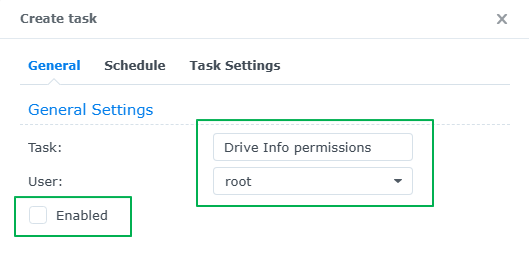
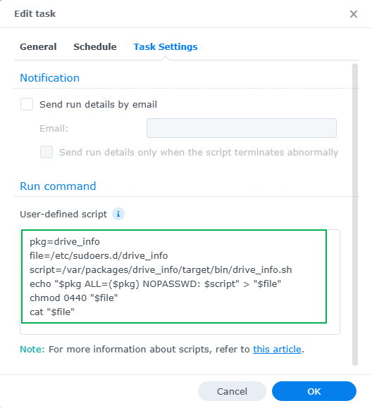
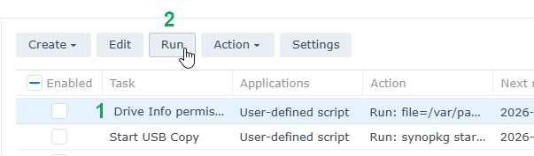

## How to set the package permissions

There are 2 ways you can set the required permissions for the package.

### Set package permissions via SSH

```
sudo -i
echo "drive_info ALL=(ALL) NOPASSWD: /var/packages/drive_info/target/ui/bin/drive_info.sh" > /etc/sudoers.d/drive_info
chmod 0440 /etc/sudoers.d/drive_info
cat /etc/sudoers.d/drive_info
```

### Set package permissions in Synology Task Scheduler

1. Go to **Control Panel** > **Task Scheduler** > click **Create** > and select **Scheduled Task**.
2. Select **User-defined script**.
3. Enter a task name.
4. Select **root** as the user (Drive Info needs to run with elevated permissions).
5. Untick **Enable** so it does **not** run on a schedule.
6. Click **Task Settings**.
7. In the box under **User-defined script** copy and paste the following. 
    ```
    pkg=drive_info
    file=/etc/sudoers.d/drive_info
    script=/var/packages/drive_info/target/ui/bin/drive_info.sh
    echo "$pkg ALL=(ALL) NOPASSWD: $script" > "$file"
    chmod 0440 "$file"
    cat "$file"
    ```
8. Click **OK** to save the settings.
9. Click on the task - but **don't** enable it - then click **Run**.
10. Once the script has run you can delete the task, or keep in case you need it again.

**Here's some screenshots showing what needs to be set:**

<p align="center">Step 1</p>
<p align="center"><kbd></kbd></p>

<p align="center">Step 2</p>
<p align="center"><kbd></kbd></p>

<p align="center">Step 3</p>
<p align="center"><kbd></kbd></p>

<p align="center">Step 4</p>
<p align="center"><kbd></kbd></p>
